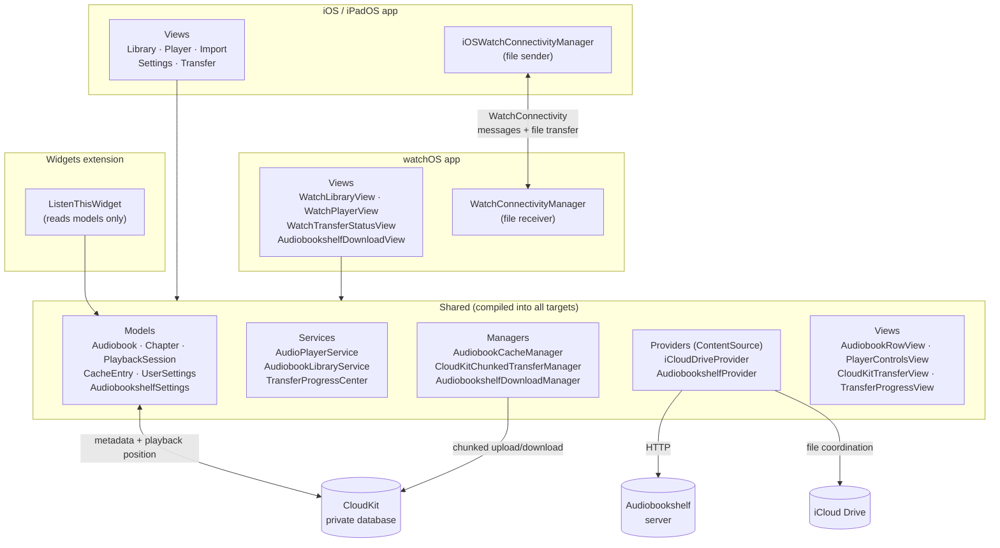
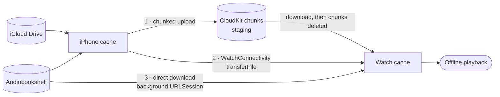

# M4B Audiobook Player - Architecture Documentation

## Project Overview

Cross-platform audiobook player for iOS, iPadOS, and watchOS with synchronized playback state and offline-first design. Supports M4B audiobook files from iCloud Drive and Audiobookshelf servers, with intelligent caching and independent device operation. (Jellyfin is a planned source, not implemented — `Audiobook.sourceType` accepts it and `ContentSource` is designed for it, but no provider exists.)

### Key Features
- Play M4B audiobooks on iPhone, iPad, and Apple Watch
- Automatic playback position sync across all devices via CloudKit
- Offline playback on all devices with device-independent caching
- Independent Watch operation without iPhone connection
- Display chapter information and artwork
- Support for multiple content sources
- Direct file transfers between iPhone and Watch via WatchConnectivity

---

## System Architecture

### High-Level Component Diagram

Three targets share one `Shared/` layer. The Watch app is a peer of the iOS
app, not a client of it — both compile the same models, services and provider
code, and either can operate without the other.



### Getting a Book onto the Watch

Three independent routes, which is why transfer state is deliberately not used
to gate actions — see *State That Can't Be Trusted* in `CLAUDE.md`.



| Route | Survives app suspension | Needs iPhone | Notes |
|---|---|---|---|
| CloudKit chunks | No — CKAsset fetches are in-process | To upload | Resumes from last completed chunk |
| WatchConnectivity | Yes — system-delivered | Yes, nearby | iPhone drives the transfer |
| Audiobookshelf direct | Yes — background `URLSession` | No | Needs network reach to the server |


### Architecture Principles

1. **Offline-First**: All platforms cache content locally for offline access
2. **Independent Operation**: Each device can function without others (especially Watch)
3. **Eventual Consistency**: CloudKit syncs playback state when network available
4. **Source Agnostic**: Abstract content providers behind common protocol
5. **Resource Aware**: Intelligent cache management respecting device constraints
6. **Device-Independent Caching**: Each device manages its own cache without sync conflicts

### Current Implementation Status

**Completed:**
- SwiftData models with CloudKit sync configuration
- Device-independent cache architecture
- iOS application with library and player views
- iCloud Drive file import and management
- WatchConnectivity file transfer (iPhone sender)
- AudioPlayerService with AVFoundation integration
- Chapter parsing and metadata extraction
- CloudKit chunked file transfer system
- iOS upload to CloudKit functionality with background support
- watchOS download from CloudKit functionality with background support
- CloudKit storage management UI
- Background URLSession for true background transfers
- Long-lived CloudKit operations for background execution
- Cellular/WiFi configuration for transfers
- Sleep timer with presets and end-of-chapter option
- Audiobookshelf integration (server URL, API key, streaming support)
- Direct Audiobookshelf download on watchOS via background URLSession
- App Transport Security exceptions for local-network (private range) servers
- CloudKit remote change notifications for Watch
- Settings sync across devices via CloudKit
- Audio background mode for watchOS streaming
- Advanced remote commands (skip forward/backward, chapter navigation, scrubbing from lock screen)
- Transfer verification: partials are discarded rather than cached as complete
- Resume for both chunked and Audiobookshelf downloads, with stale-partial sweeps
- Determinate transfer progress on library rows via `TransferProgressCenter`
- Automatic reclamation of staged CloudKit chunks once the Watch has the book

**In Progress:**
- watchOS application enhancements

**Planned:**
- Additional content sources (Jellyfin)
- Enhanced playback features (bookmarks)
- CarPlay integration

---

## Technology Stack

### iOS/iPadOS Application
- **UI Framework**: SwiftUI
- **Audio Playback**: AVFoundation (AVPlayer, AVAudioSession)
- **Persistence**: SwiftData
- **Sync**: CloudKit Private Database
- **Networking**: URLSession
- **File Management**: FileManager

### watchOS Application
- **UI Framework**: SwiftUI
- **Audio Playback**: AVFoundation with Audio Playback background mode
- **Persistence**: SwiftData (shared schema with iOS)
- **Sync**: CloudKit Private Database
- **Downloads**: URLSession with background configuration
- **Communication**: WatchConnectivity (optional, for live commands)

### Shared Components

Not a Swift package — a `Shared/` folder whose files are ticked into each
target via `membershipExceptions` in the project file. Contains the SwiftData
models, playback and library services, transfer managers, the `ContentSource`
provider abstraction, and the cross-platform SwiftUI views.

---

## Apple Watch Architecture

### Watch Storage Strategy

#### Storage Constraints
- Apple Watch Series 4+: 8-64GB total storage
- Realistic audiobook cache: 2-8GB
- Target: 1-5 books cached simultaneously

#### Three-Layer Storage Architecture

The app uses three distinct storage layers, each serving a specific purpose:

**1. iCloud Drive (Source of Truth)**
- Original audiobook files imported by user
- Path stored in `Audiobook.iCloudRelativePath` (e.g., "Documents/Audiobooks/book.m4b")
- Synced across all user's devices via iCloud Drive
- Never deleted by app
- Primary use: iPhone can play directly from iCloud Drive, source for caching

**2. Local Device Cache (Per-Device)**
- Managed by `AudiobookCacheManager`
- Location: `~/Library/Caches/Audiobooks/` on each device
- Platform-specific: iPhone cache ≠ Watch cache (different file system, different storage constraints)
- Can be cleared and re-downloaded from iCloud Drive
- Primary use: Offline playback, faster access than iCloud Drive

**3. CloudKit Chunked Transfer**
- Managed by `CloudKitChunkedTransferManager`
- Files split into 100MB chunks stored in CloudKit Private Database
- Purpose: Faster audiobook transfers from iPhone → Watch over WiFi
- Lifecycle: iPhone uploads chunks → Watch downloads chunks → chunks auto-deleted after successful Watch download
- Not permanent storage: Multi-watch edge case requires re-upload
- Primary use: Overcome WatchConnectivity transfer speed limitations

**Background Transfer Support:**
- **iOS**: Background URLSession with WiFi/cellular configuration
  - Long-lived `CKModifyRecordsOperation` for chunk uploads
  - Uploads continue even when app is terminated
  - AppDelegate handles background session completion events
  - Resume capability for interrupted uploads (detects existing chunks)
  
- **watchOS**: System-scheduled background downloads
  - `WKURLSessionRefreshBackgroundTask` handling
  - Background downloads when Watch is off-wrist or app is suspended
  - System-controlled timing (not user-initiated)
  
- **User Configuration**: 
  - Cellular data toggle (default: WiFi-only)
  - Setting syncs via CloudKit to all devices
  - Dynamic URLSession configuration based on preference

**4. Direct Audiobookshelf Download**
- Managed by `AudiobookshelfDownloadManager` (shared by iOS and watchOS)
- Single background `URLSession` transfer straight from the server into the local cache
- Available on the Watch whenever it can reach the server over WiFi, so an offline
  copy no longer has to travel iPhone → CloudKit → Watch
- Guards before starting: server reachability preflight, free space, low battery
- Resume data is persisted so an interrupted transfer continues rather than restarting
- Records a `CacheEntry` on completion, which is what makes a book read as downloaded

**Storage Decision Matrix:**
```
iPhone: iCloud Drive (source) → Local Cache (playback) → CloudKit Chunks (upload for Watch)
Watch:  CloudKit Chunks (download) → Local Cache (playback)
Watch:  Audiobookshelf server (direct download over WiFi) → Local Cache (playback)
```

**Why Three Layers?**
- iCloud Drive: User's permanent library, accessible from any Apple device
- Local Cache: Fast access, offline capability, respects device storage limits
- CloudKit Chunks: Solves Watch transfer problem (iCloud Drive not accessible on Watch, WatchConnectivity too slow)

#### Cleanup Policy (Priority Order)

Removal priority from lowest to highest:
1. Books not accessed > 90 days
2. Books not accessed > 30 days
3. Books with < 10% progress
4. Completed books (100% progress)
5. Books accessed in last 7 days
6. Currently playing book (never remove)

---

## Sync Architecture

### CloudKit Sync Strategy

**SwiftData CloudKit Configuration:**

All models sync via CloudKit Private Database in a single configuration:
  - `Audiobook` - metadata, artwork, paths
  - `Chapter` - chapter information
  - `PlaybackSession` - playback position and state
  - `CacheEntry` - cache metadata (syncs but is optional per-device)

**Model Requirements:**

CloudKit mirroring constrains the model:
- All relationships must be optional, and the `Deny` delete rule is unsupported.
- Unique constraints are unsupported, so identity can't be enforced by the store.
- Entities in one configuration must not relate to entities in another — which
  is why `CacheEntry` stays in the synced schema despite being device-local
  data; splitting it out would mean dropping the `Audiobook.cacheEntry`
  relationship entirely.

**Cache Entry Sync Behavior:**

While `CacheEntry` syncs via CloudKit, each device manages its cache independently:
- The `cacheEntry` relationship is optional on `Audiobook`
- Each device can have different cache states (one device cached, another not)
- Deleting a cache entry on one device doesn't affect other devices' files
- CloudKit only syncs the metadata about what's cached, not the actual files

#### Sync Triggers
- Playback position update (throttled, every 5 seconds during playback)
- App enters background
- Book completion
- Pause/stop playback
- Chapter navigation
- CloudKit remote change notifications (automatic)

#### Conflict Resolution

The app uses timestamp-based conflict resolution to handle cross-device sync.

**Implementation:**
- AudioPlayerService tracks `lastKnownPlayedTimestamp` when loading an audiobook
- Before saving, checks if CloudKit synced newer data from another device
- If remote `lastPlayed` is newer, adopts remote state instead of overwriting
- This prevents older local state from overwriting newer progress from another device

**Key field:** `PlaybackSession.lastPlayed: Date` - Updated on every position save

**Sync Mechanism (Simplified):**
- **Removed:** Redundant WatchConnectivity progress sync (conflicted with CloudKit)
- **Current:** Single CloudKit-based sync for all devices
- **Watch CloudKit Observer:** Detects remote changes and refreshes settings
- **Change Detection:** Only logs when settings actually change (filters out playback progress updates)
- **Duplicate Cleanup:** Automatically merges duplicate settings records, keeps most recent

#### Sync Flow

**Typical Sync Sequence:**

1. **iPhone Updates Position**
   - User plays audiobook
   - Position updates every 30 seconds
   - iPhone pushes to CloudKit with timestamp

2. **CloudKit Storage**
   - Stores PlaybackSession update
   - Triggers push notification to other devices

3. **Watch Receives Update**
   - CloudKit sends push notification
   - Watch fetches latest state
   - Compares timestamps (local vs remote)
   - Updates position if remote is newer

4. **Offline Scenario**
   - Watch updates local state during offline playback
   - Queues sync operation
   - Pushes to CloudKit when network available
   - iPhone receives notification and merges state

### Watch-iPhone Communication

#### Communication Strategy

**CloudKit (Primary Sync & File Transfer)**
- Playback position and state
- Library metadata
- Cache manifests
- Works when devices not nearby
- Handles conflicts automatically
- Batch updates
- **NEW: Chunked file transfers** (100MB chunks)

**CloudKit Chunked File Transfer** (Recommended for large audiobooks)
- Files split into 100MB chunks (well under CloudKit's 250MB asset limit)
- iPhone uploads chunks to CloudKit Private Database
- Watch downloads chunks independently over WiFi
- Files reconstructed from chunks on destination device
- Much faster than WatchConnectivity for large files
- No device proximity required
- Can resume interrupted transfers
- Works while Watch is charging
- **Chunk lifecycle**: Auto-deleted after successful Watch download to free iCloud storage
- **Chunk verification**: Both iPhone and Watch use `checkCloudKitChunks()` to verify availability before upload/download

**WatchConnectivity (Direct Transfer - Alternative)**
- Direct device-to-device transfers via Bluetooth/WiFi Direct
- Slower for large files (100+ MB)
- Requires devices nearby and paired
- Real-time progress tracking via `WatchTransferProgress`
- Useful fallback when WiFi unavailable or CloudKit issues
- Implemented in `WatchConnectivityTransferView` (iOS) and `WatchTransferStatusView` (Watch)

**Transfer Views:**
- `CloudKitTransferView` (Shared) - Modern MVVM-based view for chunked CloudKit transfers
  - Works on both iOS and watchOS
  - Auto-detects upload vs download mode based on platform
  - Shows chunk-by-chunk progress
  - Handles availability checking and error states

- `WatchConnectivityTransferView` (iOS-only) - Direct device transfer via WatchConnectivity
  - Alternative to CloudKit when WiFi unavailable
  - Requires iPhone and Watch to be nearby
  - Handles download-then-transfer if file not cached
  - Uses WatchConnectivity framework for Bluetooth/WiFi Direct transfer

**Communication Decision Matrix:**
- Metadata updates → CloudKit sync (automatic)
- Playback state → CloudKit sync (automatic)
- Large file transfers (>50MB) → **CloudKit Chunked Transfer** (recommended)
- When WiFi unavailable → WatchConnectivity Bluetooth transfer (fallback)
- Direct downloads → Watch downloads from iCloud independently (if available)

---

## Playback Architecture

### AVFoundation Setup

AudiobookPlayer manages playback using AVFoundation:
- Uses AVPlayer for audio playback
- Configures AVAudioSession with `.playback` category and `.spokenAudio` mode
- Supports both cached files and iCloud Drive sources
- Falls back to iCloud if cache unavailable

### Chapter Extraction

Chapter metadata is extracted from M4B files:
- Loads available chapter locales from AVAsset
- Extracts chapter metadata groups with best-matching language
- Parses time ranges, titles, and durations
- Stores chapters in SwiftData with relationships to audiobook

### Playback Position Tracking

Position tracking uses AVPlayer's time observer:
- 1-second interval for smooth progress updates
- Updates current position and chapter
- Triggers auto-save of playback state
- Syncs to CloudKit when position changes significantly

### Chapter Navigation

Navigation features:
- Jump to specific chapter by index
- Next/Previous chapter buttons
- Smart previous: restart if >3s into chapter, otherwise go to previous
- Automatic position restoration on chapter change

### Background Audio (Watch)

watchOS background audio configuration:
- Requires UIBackgroundModes: ["audio"] in Info.plist
- Uses `.longFormAudio` policy for extended playback
- Maintains audio session during screen lock
- Supports Now Playing info and remote controls

---

## Storage & Caching

### File Organization

**File System Structure** (same on iOS and watchOS):

| Path | Contents |
|---|---|
| `Caches/Audiobooks/<filename>` | Complete, playable downloads |
| `Caches/AudiobookPartials/<filename>.partial` | Interrupted transfers awaiting resume |
| `Caches/AudiobookshelfResume/<uuid>.resume` | URLSession resume data |
| `iCloud.com.anarkisti.Listen-This/Documents/Audiobooks/` | Imported originals |

`<filename>` comes from `Audiobook.filename` and is **not** the audiobook's UUID
in the normal cases:
- iCloud books use the last path component of `iCloudRelativePath`
- Remote books use the sanitised `sourceIdentifier`, so the cache survives
  removing and re-adding the same book
- The UUID is only a fallback when neither exists

Only `Caches/Audiobooks/` counts as "downloaded". Partials and resume data live
outside it deliberately: a file at the cache path is what the whole app reads as
playable, so an unfinished transfer parked there would show as downloaded and
play silence past the missing bytes. It also keeps them out of reach of the
orphan sweep, which only scans the cache directory.

**SwiftData (CloudKit synced):**
- `Audiobook` — metadata, artwork, `iCloudRelativePath`, source type/identifier
- `Chapter` — timing and titles
- `PlaybackSession` — position and state
- `CacheEntry` — cache metadata (syncs, though it describes a single device)
- `UserSettings` — playback, sync and transfer preferences
- `AudiobookshelfSettings` — server URL, API key, playback mode

### Device-Independent Caching

Cache state is never synced. Each device decides independently what it holds,
using computed properties rather than stored paths:

| Property | Kind | Meaning |
|---|---|---|
| `iCloudRelativePath` | synced | Canonical location in iCloud Drive |
| `expectedCachePath` | computed | Where *this* device would keep it |
| `isFileCached` | computed | Does that file exist right now |
| `cacheFileURL` | computed | Local URL, or nil |

Because status is read from the file system rather than a synced field, it can't
go stale or conflict: deleting a file updates the status implicitly, and two
devices holding different books need no reconciliation. The trade-off is that
`isFileCached` only proves a file *exists* — completeness is enforced when the
file is written, which is why partials never land at that path.

See *Key Technical Decisions* for the alternatives weighed here.

---

## Implementation Plan

The original phase-by-phase MVP checklist lived here. It had drifted into
contradiction with **Current Implementation Status** above — listing shipped
work such as the Audiobookshelf provider, the WatchConnectivity receiver and
playback position sync as still to do — so it has been removed rather than
maintained as a second, disagreeing source of truth.

Remaining work, in rough priority order:

- Jellyfin provider (`ContentSource` is designed for it; no implementation)
- Bookmarks and notes
- CarPlay integration
- Watch complications (Now Playing quick launch)
- Onboarding for first-time iCloud/Watch setup
- Listening statistics
- Siri shortcuts
- Localization (currently English only, with no string catalog)

Known issues and smaller UX items are tracked in the UX audit section of
`CLAUDE.md`.


## Key Technical Decisions

### 1. Sync Strategy
**Decision**: CloudKit Private Database as primary sync
**Rationale**:
- Automatic Apple ID association
- Built-in conflict resolution
- No server infrastructure needed
- Works across all Apple platforms

**Alternatives Considered**:
- iCloud Key-Value Store (too limited for structured data)
- Custom server (unnecessary complexity for MVP)
- Server-only (requires constant connectivity)

### 2. Watch Architecture
**Decision**: Standalone with local caching
**Rationale**:
- True offline capability
- Better user experience
- Realistic for workout scenarios
- Reduces iPhone dependency

**Alternatives Considered**:
- Stream from iPhone (requires connection)
- Pure streaming (no offline)
- Hybrid stream/cache (too complex)

### 3. Audio Framework
**Decision**: AVFoundation (AVPlayer)
**Rationale**:
- Native chapter support
- Background playback built-in
- Streaming and local file support
- Remote command center integration
- Well-documented and stable

**Alternatives Considered**:
- AVAudioEngine (too low-level)
- Third-party frameworks (unnecessary dependency)

### 4. Persistence
**Decision**: SwiftData with CloudKit
**Rationale**:
- Modern Swift-first approach
- Native CloudKit sync support
- Type-safe model definitions with macros
- Simplified relationship management
- Query performance with predicates

**Alternatives Considered**:
- Core Data (older API, more verbose)
- Realm (external dependency)
- SQLite direct (too low-level)

### 5. Content Abstraction
**Decision**: Protocol-based providers
**Rationale**:
- Easy to add new sources
- Testable architecture
- Clear separation of concerns
- Allows different authentication methods

**Implementation Pattern**: ContentSource protocol defines methods for fetching library metadata, stream URLs, and download URLs. Implementations handle provider-specific authentication and API calls.

### 6. Cache Architecture
**Decision**: Device-local cache with computed properties
**Rationale**:
- Eliminates CloudKit sync conflicts for cache state
- Each device manages its own storage independently
- Real-time cache status without database queries
- Simpler data model (no stored cache paths)
- Works seamlessly with @Observable macro

**Key Implementation:**
- `iCloudRelativePath`: Synced reference to canonical file location
- `expectedCachePath`: Computed per-device cache location
- `isFileCached`: Computed check of file existence
- `CacheEntry`: Optional relationship for cache metadata tracking

**Alternatives Considered**:
- Synced cache paths (conflicts when devices have different storage)
- Single source of truth approach (requires constant connectivity)
- Manual cache state management (error-prone, stale data)

### 7. Watch Connectivity & File Transfer
**Decision**: CloudKit chunked transfers for large files, optional WatchConnectivity for small files
**Rationale**:
- CloudKit chunked transfers are much faster for large audiobooks (200MB+ files)
- No device proximity required - Watch can download independently
- Chunking (200MB pieces) enables reliable transfers with resume capability
- CloudKit Private Database keeps transfers private and secure
- WatchConnectivity can be used as fallback for smaller files

**Implementation Benefits**:
- 5-10x faster than WatchConnectivity for large files
- Watch can download while charging overnight
- Works over WiFi without iPhone nearby
- Chunks can be downloaded in parallel for speed
- Reliable resume on network interruptions
- Progress tracking per chunk

**CloudKit Considerations**:
- Each user gets 1GB free CloudKit storage
- Chunks automatically deleted after successful download (or manual cleanup)
- 250MB asset limit per chunk (200MB gives headroom)
- Uses CloudKit Private Database (user-scoped, secure)

**Current Status**: CloudKit chunked transfer implementation ready. WatchConnectivity fallback available for edge cases.

### Watch Transfer Implementation Details

#### WatchConnectivityManager Architecture

The `WatchConnectivityManager` provides a centralized service for managing file transfers between iPhone and Apple Watch:

**Key Features:**
- Singleton pattern for global access
- Observable properties for UI binding
- Transfer progress tracking
- Error handling with user-friendly messages
- NSFileCoordinator integration for iCloud safety

**Transfer Process:**

```
1. User Action
   └─> Context menu "Send to Watch"

2. Pre-flight Checks
   ├─> Session activated?
   ├─> Watch paired?
   ├─> Watch app installed?
   └─> Watch reachable?

3. File Access
   ├─> Check iPhone cache first
   └─> If not cached, access iCloud with NSFileCoordinator

4. Transfer Initiation
   ├─> WCSession.transferFile()
   ├─> Set metadata (audiobook UUID, title, size)
   └─> Update transferProgress

5. Progress Monitoring
   ├─> Observable property updates
   └─> UI reflects current state

6. Completion (Watch side - planned)
   ├─> Receive file in delegate
   ├─> Save to Watch cache directory
   ├─> Update CacheEntry model
   └─> Notify completion
```

**Error Scenarios:**
- Watch not paired: "Apple Watch not paired"
- Watch app not installed: "Install app on Watch"
- File not found: "Audiobook file not available"
- Transfer failed: "Transfer failed, try again"

---

## Error Handling Strategy

### Error Categories

AudiobookError enum categorizes errors into:
- Network errors (networkUnavailable, authenticationFailed, serverUnreachable)
- Storage errors (insufficientSpace, fileNotFound, downloadFailed)
- Playback errors (unsupportedFormat, corruptedFile, playbackFailed)
- Sync errors (syncConflict, cloudKitUnavailable, quotaExceeded)

### User-Facing Messages

Error extension provides user-friendly messages:
- Network: "No network connection. Content will download when WiFi is available."
- Storage: "Not enough storage. Remove some books to free up space."
- Sync: "Playback position updated on another device. Using latest position."

Errors are categorized as recoverable (network, CloudKit) or permanent (unsupported format, corrupted).

---

## Testing Strategy

Tests are organized by feature in `Listen This AppTests/`:

| File | Purpose |
|------|---------|
| `TestHelpers.swift` | Shared utilities (containers, factories) |
| `TransferTests.swift` | CloudKit & WatchConnectivity transfers |
| `CacheTests.swift` | Cache manager & file system |
| `ModelTests.swift` | SwiftData models & boundaries |
| `ConcurrencyTests.swift` | Thread safety, errors, performance |
| `PlaybackSyncTests.swift` | Cross-device playback sync |

### Test Categories

**Transfer Tests** - File transfers between devices and CloudKit
**Cache Tests** - Local file caching and cleanup
**Model Tests** - SwiftData relationships and queries
**Concurrency Tests** - Thread safety and error recovery
**Playback Sync Tests** - Cross-device timestamp conflict resolution

### Running Tests

```bash
# Run all tests
xcodebuild test -scheme "Listen This" -destination 'platform=iOS Simulator,name=iPhone 17'

# Run specific suite
xcodebuild test -scheme "Listen This" -destination 'platform=iOS Simulator,name=iPhone 17' \
  -only-testing:"Listen This AppTests/PlaybackStateSyncTests"
```

See `Listen This AppTests/TESTING.md` for complete documentation.

---

## Performance Considerations

### Watch Constraints

| Constraint | Impact | Mitigation |
|------------|--------|------------|
| Limited storage | Can't cache many books | Max 3 books, aggressive cleanup |
| Battery drain | Downloads consume power | Only on charger, background config |
| Memory limits | Can't load large files | Stream from local file |
| Slow WiFi | Long download times | Show progress, allow cancellation |
| Processing power | Slow metadata parsing | Cache parsed data, lazy load |

### Optimization Strategies

**Artwork Handling**
- Compress artwork for Watch display (200x200px target size)
- Use JPEG compression (0.7 quality) for smaller file sizes
- Reduces transfer time and Watch storage

**Metadata Lazy Loading**
- Fetch only essential fields initially
- Load artwork on-demand when needed
- Reduces initial load time and memory usage

**Playback Position Throttling**
- Throttle position updates to every 5 seconds during playback
- Prevents excessive CloudKit writes
- Reduces battery usage and network traffic
- Only saves when actively playing (not paused)

---

## Security & Privacy

### Authentication
- CloudKit: Automatic Apple ID authentication
- Jellyfin: API token stored in Keychain
- AudiobookShelf: API key held in `AudiobookshelfSettings`, synced to the user's
  own devices through the CloudKit private database (the Watch needs it to talk
  to the server on its own)
- No passwords stored locally

### Data Privacy
- All playback data in CloudKit Private Database (user-scoped)
- Local files encrypted at rest (iOS/watchOS file system)
- No telemetry or analytics in MVP
- No data shared with third parties

### Network Security
- HTTPS required for any server reachable beyond the local network
- Cleartext HTTP permitted only to local addresses, so a self-hosted server on a
  home network works without weakening transport security elsewhere. Declared in
  both app targets' Info.plists as `NSAllowsLocalNetworking` plus
  `NSExceptionDomains` entries for the private and link-local CIDR ranges
  (App Transport Security stopped exempting IP literals by default in iOS 17)
- `ABSServerAddress` classifies a configured address so the UI can warn about an
  unusable `http://` server rather than letting it fail opaquely
- Certificate pinning for custom servers (optional)
- Token refresh handling
- Secure credential storage

---

## Accessibility

### VoiceOver Support
- All UI elements labeled
- Playback position announcements
- Chapter navigation accessible
- Download progress spoken

### Dynamic Type
- All text respects user font size
- Layout adapts to larger text
- No fixed font sizes

### Reduced Motion
- Respect reduce motion preference
- Disable unnecessary animations
- Instant transitions option

---

## Localization

**Not implemented.** UI strings are hardcoded English literals — there is no
string catalog or `.lproj` in the project, so adding a language means extracting
strings first. Dates and durations do go through `RelativeDateTimeFormatter` and
`ByteCountFormatter`, so those already follow the device locale.

---

## Deployment

### Requirements
- Xcode 15.0+
- iOS 17.0+
- iPadOS 17.0+
- watchOS 10.0+
- Swift 5.9+

### App Store Metadata
- Category: Books & Reference
- Age Rating: 4+
- Privacy Nutrition Labels: Required
- App Privacy: File access, CloudKit usage

### Build Configuration
```swift
// Build settings
SWIFT_VERSION = 5.9
IPHONEOS_DEPLOYMENT_TARGET = 17.0
WATCHOS_DEPLOYMENT_TARGET = 10.0

// Capabilities required
- iCloud (CloudKit)
- Background Modes (Audio, Background Fetch)
- File Provider (iCloud Drive)
```

---

## Project Structure

The directory tree lives in `CLAUDE.md` alongside the target-membership rule
that governs it — kept in one place so the two can't disagree.

### View Organization

iOS views are grouped by **feature** rather than by type:

| Folder | Purpose |
|--------|---------|
| `Library/` | Audiobook browsing, search, deletion |
| `Player/` | Playback controls, sleep timer, chapters |
| `Settings/` | App preferences, storage, sync configuration |
| `Transfer/` | Watch file transfers and method selection |
| `Import/` | File import from iCloud Drive |

**Conventions:**
- `*View` suffix for full screens
- `*Sheet` suffix for modal presentations
- Shared components used across features go in `Shared/Views/`
- Root `ContentView.swift` stays at `iOS/Views/` level

---

## Reference Links

- [AVFoundation Programming Guide](https://developer.apple.com/documentation/avfoundation)
- [CloudKit Documentation](https://developer.apple.com/documentation/cloudkit)
- [Core Data Programming Guide](https://developer.apple.com/documentation/coredata)
- [WatchOS App Development](https://developer.apple.com/documentation/watchos-apps)
- [Background Execution](https://developer.apple.com/documentation/uikit/app_and_environment/scenes/preparing_your_ui_to_run_in_the_background)
