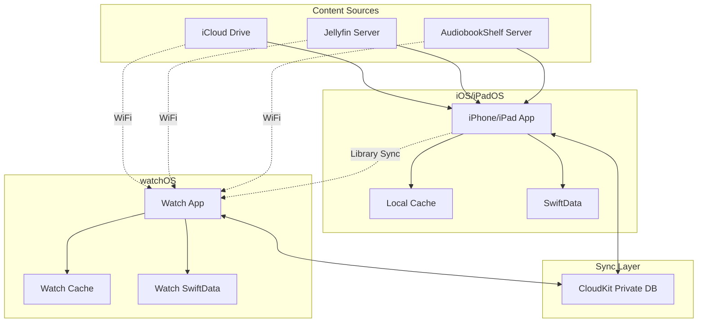
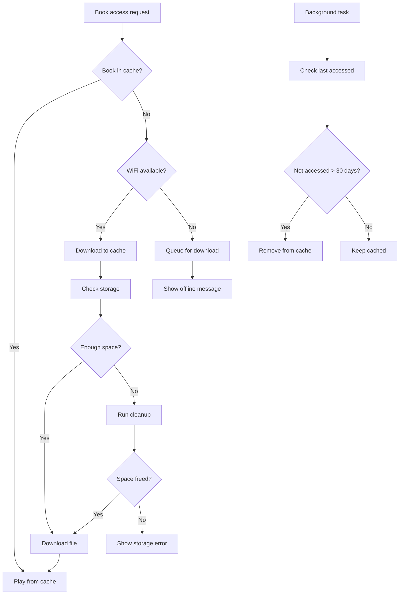
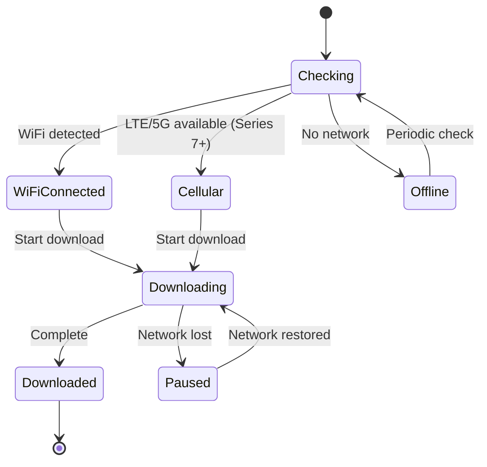
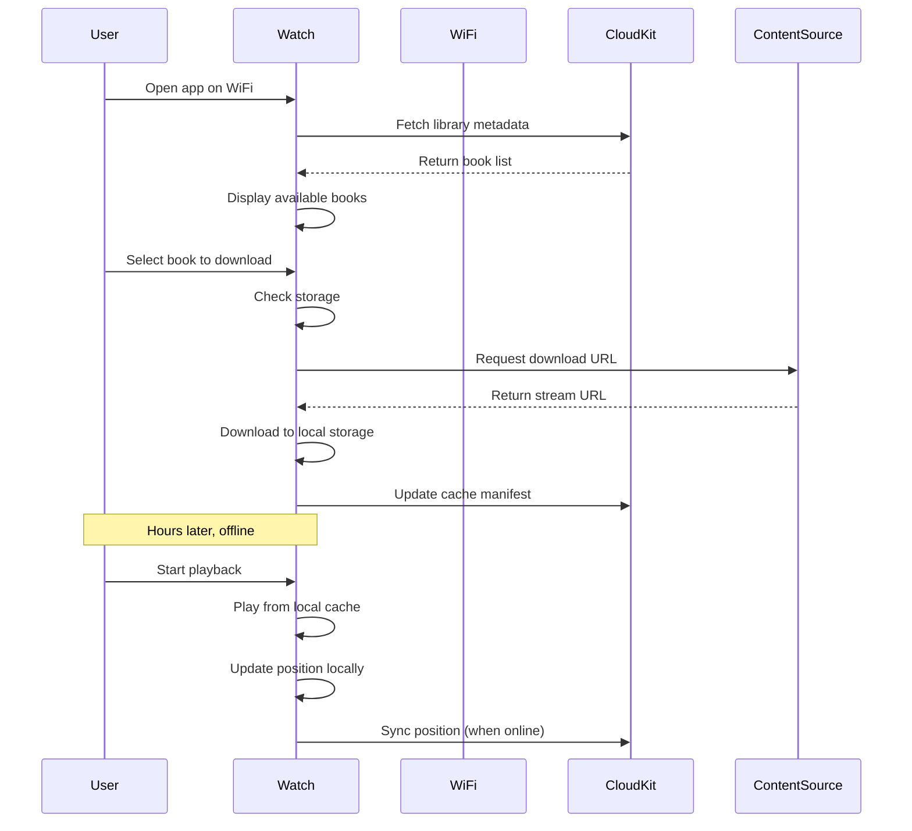
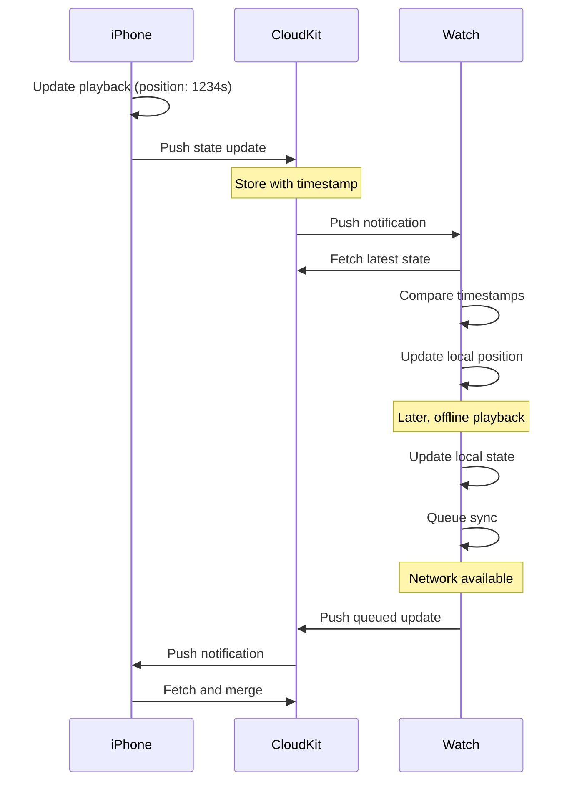
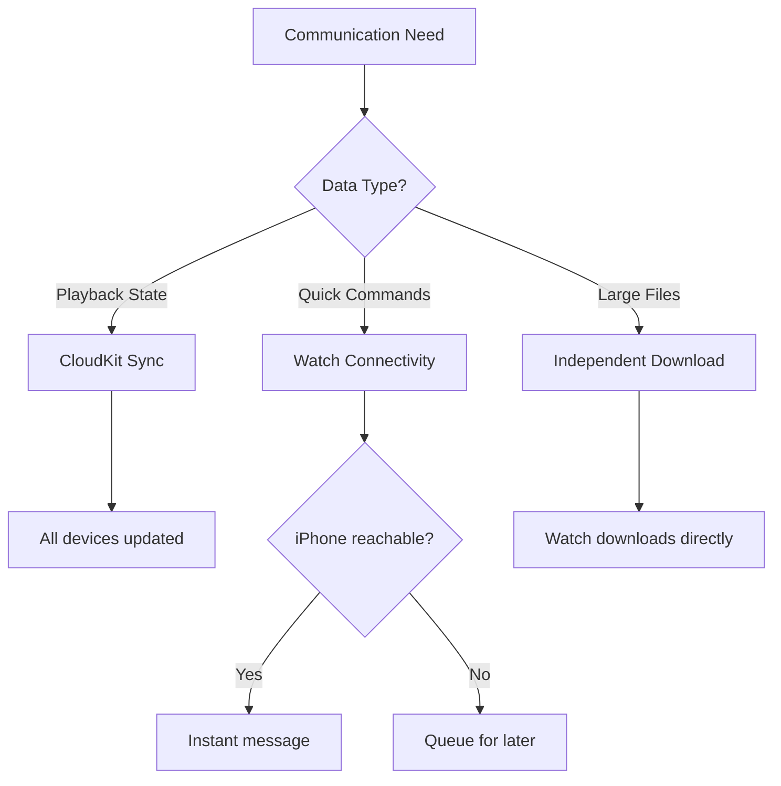

# M4B Audiobook Player - Architecture Documentation

## Project Overview

Cross-platform audiobook player for iOS, iPadOS, and watchOS with synchronized playback state and offline-first design. Supports M4B audiobook files from multiple sources (iCloud Drive, Jellyfin, AudiobookShelf) with intelligent caching and independent device operation.

### Key Features
- Play M4B audiobooks on iPhone, iPad, and Apple Watch
- Automatic playback position sync across all devices
- Offline playback with smart caching on Apple Watch
- Independent Watch operation without iPhone connection
- Display chapter information and artwork
- Support for multiple content sources

---

## System Architecture

### High-Level Architecture Diagram



### Architecture Principles

1. **Offline-First**: All platforms cache content locally for offline access
2. **Independent Operation**: Each device can function without others (especially Watch)
3. **Eventual Consistency**: CloudKit syncs playback state when network available
4. **Source Agnostic**: Abstract content providers behind common protocol
5. **Resource Aware**: Intelligent cache management respecting device constraints

---

## Technology Stack

### iOS/iPadOS Application
- **UI Framework**: SwiftUI
- **Audio Playback**: AVFoundation (AVPlayer, AVAudioSession)
- **Persistence**: SwiftData
- **Sync**: CloudKit Private Database
- **Networking**: URLSession
- **File Management**: FileManager

### watchOS Application
- **UI Framework**: SwiftUI
- **Audio Playback**: AVFoundation with Audio Playback background mode
- **Persistence**: SwiftData (shared schema with iOS)
- **Sync**: CloudKit Private Database
- **Downloads**: URLSession with background configuration
- **Communication**: WatchConnectivity (optional, for live commands)

### Shared Components
- Swift Package for business logic
- Common data models and protocols
- Content provider abstractions
- Sync manager
- Cache management utilities

---

## Data Models

### SwiftData Schema

#### Audiobook Entity
```swift
@Model
class Audiobook {
    @Attribute(.unique) var id: UUID
    var title: String
    var author: String
    var narrator: String?
    @Attribute(.externalStorage) var artworkData: Data?
    var duration: Double  // Total duration in seconds
    var fileSize: Int64   // File size in bytes
    var sourceType: String  // "icloud", "jellyfin", "audiobookshelf"
    var sourcePath: String  // Original path/URL
    var localFilePath: String?  // Cached file path if downloaded
    var isCached: Bool
    var downloadDate: Date?
    var lastAccessedDate: Date
    var lastSyncedDate: Date
    var chapterCount: Int
    var isArchived: Bool
    
    @Relationship(deleteRule: .cascade) var chapters: [Chapter]
    @Relationship(deleteRule: .cascade) var playbackSession: PlaybackSession?
    @Relationship(deleteRule: .cascade) var cacheEntry: CacheEntry?
}
```

#### Chapter Entity
```swift
@Model
class Chapter {
    @Attribute(.unique) var id: UUID
    var index: Int
    var title: String
    var startTime: Double  // Start time in seconds
    var duration: Double   // Chapter duration in seconds
    
    @Relationship var audiobook: Audiobook?
}
```

#### PlaybackSession Entity
```swift
@Model
class PlaybackSession {
    @Attribute(.unique) var id: UUID
    var currentPosition: Double  // Current playback position in seconds
    var currentChapter: Int      // Current chapter index
    var playbackRate: Double     // Playback speed (0.5 - 2.0)
    var lastSynced: Date        // Last CloudKit sync
    var lastPlayed: Date        // Last playback activity
    var progressPercentage: Double  // 0.0 - 100.0
    var isCompleted: Bool
    
    @Relationship var audiobook: Audiobook?
}
```

#### CacheEntry Entity
```swift
@Model
class CacheEntry {
    @Attribute(.unique) var id: UUID
    var filePath: String         // Local file path
    var fileSize: Int64          // Size in bytes
    var downloadedDate: Date     // When downloaded
    var lastAccessedDate: Date   // Last access for LRU
    var expirationDate: Date?    // Optional expiration
    
    @Relationship var audiobook: Audiobook?
}
```

### CloudKit Schema

#### PlaybackState Record Type
```swift
struct PlaybackState {
    let recordType = "PlaybackState"
    
    // Fields
    var bookIdentifier: String      // CKRecord.Reference to AudiobookMetadata
    var position: Double            // Current position in seconds
    var lastUpdated: Date          // Timestamp for conflict resolution
    var deviceName: String         // "iPhone 15 Pro", "Apple Watch Series 9"
    var deviceType: String         // "iphone", "ipad", "watch"
    var chapterIndex: Int          // Current chapter
    var playbackRate: Double       // Playback speed
    var isCompleted: Bool          // Finished book?
}
```

#### AudiobookMetadata Record Type
```swift
struct AudiobookMetadata {
    let recordType = "AudiobookMetadata"
    
    // Fields
    var identifier: String         // Unique identifier (indexed)
    var title: String
    var author: String
    var artworkAsset: CKAsset      // Cover image
    var duration: Double           // Total duration
    var fileSize: Int64           // Original file size
    var sourceType: String        // "icloud", "jellyfin", "audiobookshelf"
    var sourceURL: String         // Original URL/path
    var chapterCount: Int
    var addedDate: Date
}
```

#### DeviceCacheManifest Record Type
```swift
struct DeviceCacheManifest {
    let recordType = "DeviceCacheManifest"
    
    // Fields
    var deviceIdentifier: String   // Unique device ID (indexed)
    var cachedBooks: [String]      // List of cached book identifiers
    var totalCacheSize: Int64      // Total cache usage in bytes
    var lastUpdated: Date
}
```

---

## Content Provider Architecture

### ContentSource Protocol

```swift
protocol ContentSource {
    // Authentication
    func authenticate(credentials: Credentials) async throws
    func validateAccess() async throws -> Bool
    
    // Library Management
    func fetchLibrary() async throws -> [AudiobookMetadata]
    func getAudiobookMetadata(identifier: String) async throws -> AudiobookMetadata
    func searchLibrary(query: String) async throws -> [AudiobookMetadata]
    
    // Content Access
    func getStreamURL(identifier: String) async throws -> URL
    func getDownloadURL(identifier: String) async throws -> URL
    func getArtwork(identifier: String) async throws -> Data
    
    // Optional: Server-side progress sync
    func syncProgress(identifier: String, position: Double) async throws
    func getProgress(identifier: String) async throws -> Double?
}
```

### Provider Implementations

#### iCloudDriveProvider
```swift
class iCloudDriveProvider: ContentSource {
    // Uses FileManager for ubiquity container
    // Monitors NSMetadataQuery for file changes
    // Returns file:// URLs for local access
}
```

#### JellyfinProvider
```swift
class JellyfinProvider: ContentSource {
    // HTTP API client for Jellyfin
    // Handles authentication tokens
    // Returns streaming URLs with auth headers
    // Optional: Uses Jellyfin's progress tracking
}
```

#### AudiobookShelfProvider
```swift
class AudiobookShelfProvider: ContentSource {
    // HTTP API client for AudiobookShelf
    // Handles API key authentication
    // Returns streaming URLs
    // Optional: Uses ABS progress sync
}
```

---

## Apple Watch Architecture

### Watch Storage Strategy

#### Storage Constraints
- Apple Watch Series 4+: 8-32GB total storage
- watchOS system reserves significant space
- Realistic audiobook cache: 2-8GB
- Target: 1-3 books cached simultaneously

#### Cache Management Flow



#### Cleanup Policy (Priority Order)

Removal priority from lowest to highest:
1. Books not accessed > 90 days
2. Books not accessed > 30 days
3. Books with < 10% progress
4. Completed books (100% progress)
5. Books accessed in last 7 days
6. Currently playing book (never remove)

### Watch Download Manager

```swift
class WatchDownloadManager {
    // Configuration
    let maxConcurrentDownloads = 1  // Watch constraint
    let maxCachedBooks = 3
    
    // Background download session
    private lazy var session: URLSession = {
        let config = URLSessionConfiguration.background(
            withIdentifier: "com.app.audiobook.watch.download"
        )
        config.discretionary = true  // Download on charger
        config.sessionSendsLaunchEvents = true
        return URLSession(configuration: config, delegate: self, delegateQueue: nil)
    }()
    
    // Public interface
    func downloadBook(identifier: String) async throws -> URL
    func cancelDownload(identifier: String)
    func pauseDownload(identifier: String)
    func getDownloadProgress(identifier: String) -> Double
    func listCachedBooks() -> [Audiobook]
    func removeFromCache(identifier: String) throws
    func estimateAvailableSpace() -> Int64
}
```

### Watch Network States



### Independent Watch Operation



---

## Sync Architecture

### CloudKit Sync Strategy

#### Sync Triggers
- Playback position update (debounced, every 30 seconds)
- App enters background
- Book completion
- Manual sync request
- Periodic background refresh (every 15 minutes)

#### Conflict Resolution

```swift
enum ConflictResolution {
    case useLatest        // Most recent timestamp wins
    case useHighestProgress  // Furthest position wins
    case manual           // Ask user
}

func resolveConflict(local: PlaybackState, remote: PlaybackState) -> PlaybackState {
    // Default strategy: use latest timestamp
    if local.lastUpdated > remote.lastUpdated {
        return local
    } else {
        return remote
    }
}
```

#### Sync Flow



### Watch-iPhone Communication

#### When to Use Each Method



#### Communication Methods

**CloudKit (Primary Sync)**
- Playback position and state
- Library metadata
- Cache manifests
- Works when devices not nearby
- Handles conflicts
- Batch updates

**Watch Connectivity (Optional Real-time)**
- Live playback control when iPhone nearby
- Quick command relay (play/pause/skip)
- Small data transfer (< 64KB)
- Not reliable for critical sync
- Requires iPhone app active

---

## Playback Architecture

### AVFoundation Setup

```swift
class AudiobookPlayer {
    private var player: AVPlayer
    private var timeObserver: Any?
    private var audioSession: AVAudioSession
    
    // Initialize audio session
    func setupAudioSession() {
        audioSession = AVAudioSession.sharedInstance()
        try? audioSession.setCategory(
            .playback,
            mode: .spokenAudio,
            options: []
        )
        try? audioSession.setActive(true)
    }
    
    // Load audiobook
    func load(audiobook: Audiobook) async throws {
        let asset: AVAsset
        
        if let localPath = audiobook.localFilePath {
            // Play from cache
            let url = URL(fileURLWithPath: localPath)
            asset = AVAsset(url: url)
        } else {
            // Stream from source
            let provider = getProvider(for: audiobook.sourceType)
            let streamURL = try await provider.getStreamURL(identifier: audiobook.id.uuidString)
            asset = AVAsset(url: streamURL)
        }
        
        let playerItem = AVPlayerItem(asset: asset)
        player.replaceCurrentItem(with: playerItem)
        
        // Extract chapters
        try await loadChapters(from: asset, for: audiobook)
    }
    
    // Extract chapter metadata
    func loadChapters(from asset: AVAsset, for audiobook: Audiobook) async throws {
        let languages = try await asset.load(.availableChapterLocales)
        guard let locale = languages.first else { return }
        
        let chapterMetadata = try await asset.load(.chapterMetadataGroups(
            bestMatchingPreferredLanguages: [locale.languageCode ?? "en"]
        ))
        
        // Parse and store chapters
        for (index, group) in chapterMetadata.enumerated() {
            let chapter = Chapter()
            chapter.index = index
            chapter.startTime = group.timeRange.start.seconds
            chapter.duration = group.timeRange.duration.seconds
            chapter.title = extractChapterTitle(from: group)
            chapter.audiobook = audiobook
            
            modelContext.insert(chapter)
        }
    }
    
    // Playback position tracking
    func startPositionTracking() {
        let interval = CMTime(seconds: 1.0, preferredTimescale: 600)
        timeObserver = player.addPeriodicTimeObserver(
            forInterval: interval,
            queue: .main
        ) { [weak self] time in
            self?.updatePlaybackPosition(time.seconds)
        }
    }
}
```

### Chapter Navigation

```swift
extension AudiobookPlayer {
    func skipToChapter(_ chapter: Chapter) {
        let time = CMTime(seconds: chapter.startTime, preferredTimescale: 600)
        player.seek(to: time)
    }
    
    func nextChapter() {
        guard let current = currentChapter,
              let next = audiobook.chapters.first(where: { $0.index == current.index + 1 })
        else { return }
        
        skipToChapter(next)
    }
    
    func previousChapter() {
        guard let current = currentChapter else { return }
        
        // If > 3 seconds into chapter, restart it
        if currentPosition - current.startTime > 3.0 {
            skipToChapter(current)
        } else if let previous = audiobook.chapters.first(where: { $0.index == current.index - 1 }) {
            skipToChapter(previous)
        }
    }
}
```

### Background Audio (Watch)

```swift
// Info.plist configuration required
// UIBackgroundModes: ["audio"]

// Watch-specific audio setup
func setupWatchAudioSession() {
    let session = AVAudioSession.sharedInstance()
    
    try? session.setCategory(
        .playback,
        mode: .spokenAudio,
        policy: .longFormAudio,  // Watch-specific
        options: []
    )
    
    try? session.setActive(true)
}
```

---

## Storage & Caching

### File Organization

```
iOS/iPadOS:
Application Support/
├── Audiobooks/
│   ├── {book-uuid-1}.m4b
│   ├── {book-uuid-2}.m4b
│   └── {book-uuid-3}.m4b
├── Artwork/
│   ├── {book-uuid-1}.jpg
│   └── {book-uuid-2}.jpg
├── Metadata/
│   └── CoreData.sqlite
└── Cache/
    └── temp-downloads/

watchOS:
Application Support/
├── Audiobooks/
│   ├── {book-uuid-1}.m4b  (max books depending on the available diskspace)
│   ├── {book-uuid-2}.m4b
│   └── {book-uuid-3}.m4b
├── Artwork/
│   └── {book-uuid}.jpg (compressed)
└── Metadata/
    ├── CoreData.sqlite
    └── cache-manifest.json
```

### Cache Manager

```swift
class CacheManager {
    // Storage limits
    let maxCacheSizeIOS: Int64 = 10 * 1024 * 1024 * 1024  // 10GB
    let maxCacheSizeWatch: Int64 = 3 * 1024 * 1024 * 1024 // 3GB
    let maxBooksWatch = 3
    
    // Get current cache size
    func getTotalCacheSize() -> Int64 {
        let cacheURL = getCacheDirectory()
        return calculateDirectorySize(cacheURL)
    }
    
    // Check if enough space for download
    func canCache(book: Audiobook) -> Bool {
        let available = getAvailableSpace()
        let required = book.fileSize
        let current = getTotalCacheSize()
        
        #if os(watchOS)
        let maxSize = maxCacheSizeWatch
        let maxBooks = maxBooksWatch
        #else
        let maxSize = maxCacheSizeIOS
        let maxBooks = Int.max
        #endif
        
        if current + required > maxSize {
            return false
        }
        
        if getCachedBooksCount() >= maxBooks {
            return false
        }
        
        return available >= required
    }
    
    // Run cleanup algorithm
    func runCleanup(requiredSpace: Int64) throws {
        var freedSpace: Int64 = 0
        let books = getCachedBooks()
            .sorted { calculatePriority($0) < calculatePriority($1) }
        
        for book in books {
            guard freedSpace < requiredSpace else { break }
            
            if shouldRemove(book) {
                try removeFromCache(book)
                freedSpace += book.fileSize
            }
        }
        
        if freedSpace < requiredSpace {
            throw CacheError.insufficientSpace
        }
    }
    
    // Priority calculation for LRU
    func calculatePriority(_ book: Audiobook) -> Double {
        let daysSinceAccess = Date().timeIntervalSince(book.lastAccessedDate) / 86400
        let progress = book.playbackSession?.progressPercentage ?? 0
        let accessCount = getAccessCount(book, days: 30)
        let isUserRequested = book.downloadDate != nil
        
        let score = (-2.0 * daysSinceAccess) +
                    (1.5 * progress) +
                    (1.0 * Double(accessCount)) +
                    (isUserRequested ? 10.0 : 0.0)
        
        return score
    }
    
    // Determine if book should be removed
    func shouldRemove(_ book: Audiobook) -> Bool {
        let daysSinceAccess = Date().timeIntervalSince(book.lastAccessedDate) / 86400
        let priority = calculatePriority(book)
        let isPlaying = book.playbackSession?.lastPlayed.timeIntervalSinceNow ?? -1000 > -60
        
        if isPlaying { return false }  // Never remove currently playing
        if daysSinceAccess > 90 { return true }
        if daysSinceAccess > 30 && priority < 0 { return true }
        
        return false
    }
}
```

### File Size Estimates

```
Average M4B audiobook (10-15 hours):
- 64 kbps: 200-300MB
- 96 kbps: 300-450MB
- 128 kbps: 400-600MB

Per book overhead:
- Artwork: 500KB - 2MB
- Metadata: ~50KB
- SwiftData: ~10MB shared

Watch capacity examples:
- 4GB available → 8-20 books (theoretical)
- 3GB cache limit → 6-15 books (practical)
- 3 book limit → actual target for UX
```

---

## MVP Implementation Plan

### Phase 1: Core Foundation (MVP)

**Shared Components**
- [x] Define SwiftData schema
- [ ] Implement ContentSource protocol
- [ ] Create iCloudDriveProvider
- [ ] Build sync manager (CloudKit)
- [ ] Implement cache manager base

**iOS/iPadOS App**
- [x] SwiftUI app structure
- [x] Library view (browse audiobooks)
- [x] Player view with controls
- [x] Chapter navigation UI
- [x] Artwork display
- [ ] AVPlayer integration
- [ ] Local file caching
- [ ] CloudKit sync integration
- [ ] Background playback

**watchOS App**
- [ ] SwiftUI app structure
- [ ] Library browsing on WiFi
- [ ] Download manager implementation
- [ ] Local cache storage
- [ ] AVPlayer integration with background mode
- [ ] Simple playback controls
- [ ] CloudKit sync integration
- [ ] Basic cache cleanup (LRU)

**Sync & State**
- [ ] CloudKit schema setup
- [ ] Playback position sync
- [ ] Library metadata sync
- [ ] Conflict resolution
- [ ] Offline queue

### Phase 2: Extended Sources

- [ ] Jellyfin provider implementation
- [ ] AudiobookShelf provider implementation
- [ ] Source selection UI
- [ ] Authentication flows
- [ ] Server configuration settings
- [ ] Download queue management
- [ ] Smart watch cache (predictive)
- [ ] Background downloads on charger
- [ ] Playback speed control
- [ ] Manual cache management UI

### Phase 3: Advanced Features

- [ ] Sleep timer
- [ ] Bookmarks and notes
- [ ] Watch complications
- [ ] Cellular downloads (Watch Series 7+)
- [ ] Advanced cache policies
- [ ] Listening statistics
- [ ] CarPlay integration
- [ ] Siri shortcuts
- [ ] Widget support

---

## Key Technical Decisions

### 1. Sync Strategy
**Decision**: CloudKit Private Database as primary sync
**Rationale**:
- Automatic Apple ID association
- Built-in conflict resolution
- No server infrastructure needed
- Works across all Apple platforms

**Alternatives Considered**:
- iCloud Key-Value Store (too limited for structured data)
- Custom server (unnecessary complexity for MVP)
- Server-only (requires constant connectivity)

### 2. Watch Architecture
**Decision**: Standalone with local caching
**Rationale**:
- True offline capability
- Better user experience
- Realistic for workout scenarios
- Reduces iPhone dependency

**Alternatives Considered**:
- Stream from iPhone (requires connection)
- Pure streaming (no offline)
- Hybrid stream/cache (too complex)

### 3. Audio Framework
**Decision**: AVFoundation (AVPlayer)
**Rationale**:
- Native chapter support
- Background playback built-in
- Streaming and local file support
- Remote command center integration
- Well-documented and stable

**Alternatives Considered**:
- AVAudioEngine (too low-level)
- Third-party frameworks (unnecessary dependency)

### 4. Persistence
**Decision**: SwiftData with CloudKit
**Rationale**:
- Modern Swift-first approach
- Native CloudKit sync support
- Type-safe model definitions with macros
- Simplified relationship management
- Query performance with predicates

**Alternatives Considered**:
- Core Data (older API, more verbose)
- Realm (external dependency)
- SQLite direct (too low-level)

### 5. Content Abstraction
**Decision**: Protocol-based providers
**Rationale**:
- Easy to add new sources
- Testable architecture
- Clear separation of concerns
- Allows different authentication methods

**Implementation Pattern**:
```swift
protocol ContentSource {
    func fetchLibrary() async throws -> [AudiobookMetadata]
    func getStreamURL(identifier: String) async throws -> URL
    func getDownloadURL(identifier: String) async throws -> URL
}
```

---

## Error Handling Strategy

### Error Categories

```swift
enum AudiobookError: Error {
    // Network errors
    case networkUnavailable
    case authenticationFailed
    case serverUnreachable
    
    // Storage errors
    case insufficientSpace
    case fileNotFound
    case downloadFailed
    
    // Playback errors
    case unsupportedFormat
    case corruptedFile
    case playbackFailed
    
    // Sync errors
    case syncConflict
    case cloudKitUnavailable
    case quotaExceeded
}
```

### User-Facing Messages

```swift
extension AudiobookError {
    var userMessage: String {
        switch self {
        case .networkUnavailable:
            return "No network connection. Content will download when WiFi is available."
        case .insufficientSpace:
            return "Not enough storage. Remove some books to free up space."
        case .syncConflict:
            return "Playback position updated on another device. Using latest position."
        // ... etc
        }
    }
    
    var isRecoverable: Bool {
        switch self {
        case .networkUnavailable, .cloudKitUnavailable:
            return true  // Can retry later
        case .unsupportedFormat, .corruptedFile:
            return false  // Permanent failure
        default:
            return true
        }
    }
}
```

---

## Testing Strategy

### Unit Tests
- Content provider implementations
- Cache management logic
- Sync conflict resolution
- Chapter parsing
- Priority calculation algorithms

### Integration Tests
- CloudKit sync flows
- Download manager
- Playback state persistence
- Watch-iPhone communication

### UI Tests
- Library browsing
- Playback controls
- Download flows
- Offline scenarios

### Device Testing Matrix
- iPhone (iOS 17+)
- iPad (iPadOS 17+)
- Apple Watch Series 4+ (watchOS 10+)
- Various storage configurations

---

## Performance Considerations

### Watch Constraints

| Constraint | Impact | Mitigation |
|------------|--------|------------|
| Limited storage | Can't cache many books | Max 3 books, aggressive cleanup |
| Battery drain | Downloads consume power | Only on charger, background config |
| Memory limits | Can't load large files | Stream from local file |
| Slow WiFi | Long download times | Show progress, allow cancellation |
| Processing power | Slow metadata parsing | Cache parsed data, lazy load |

### Optimization Strategies

**Artwork Handling**
```swift
// Compress artwork for Watch
func compressArtworkForWatch(_ imageData: Data) -> Data {
    guard let image = UIImage(data: imageData) else { return imageData }
    
    let targetSize = CGSize(width: 200, height: 200)  // Watch display size
    let scaledImage = image.scaled(to: targetSize)
    
    return scaledImage.jpegData(compressionQuality: 0.7) ?? imageData
}
```

**Metadata Lazy Loading**
```swift
// Don't load all metadata upfront
func fetchLibrary() async throws -> [AudiobookMetadata] {
    // Only fetch essential fields
    let books = try await provider.fetchLibrary()
    
    // Load artwork on-demand
    return books.map { book in
        var metadata = book
        metadata.artwork = nil  // Lazy load later
        return metadata
    }
}
```

**Background Sync Throttling**
```swift
// Debounce position updates
private var syncTimer: Timer?

func updatePosition(_ position: Double) {
    syncTimer?.invalidate()
    syncTimer = Timer.scheduledTimer(withTimeInterval: 30.0, repeats: false) { _ in
        Task {
            await self.syncToCloud()
        }
    }
}
```

---

## Security & Privacy

### Authentication
- CloudKit: Automatic Apple ID authentication
- Jellyfin: API token stored in Keychain
- AudiobookShelf: API key stored in Keychain
- No passwords stored locally

### Data Privacy
- All playback data in CloudKit Private Database (user-scoped)
- Local files encrypted at rest (iOS/watchOS file system)
- No telemetry or analytics in MVP
- No data shared with third parties

### Network Security
- HTTPS required for all network providers
- Certificate pinning for custom servers (optional)
- Token refresh handling
- Secure credential storage

---

## Accessibility

### VoiceOver Support
- All UI elements labeled
- Playback position announcements
- Chapter navigation accessible
- Download progress spoken

### Dynamic Type
- All text respects user font size
- Layout adapts to larger text
- No fixed font sizes

### Reduced Motion
- Respect reduce motion preference
- Disable unnecessary animations
- Instant transitions option

---

## Localization

### Supported Languages (Phase 1)
- English (primary)

### Future Languages
- Spanish
- French
- German
- Japanese

### Localized Elements
- UI strings
- Error messages
- Time formatting
- Duration display

---

## Deployment

### Requirements
- Xcode 15.0+
- iOS 17.0+
- iPadOS 17.0+
- watchOS 10.0+
- Swift 5.9+

### App Store Metadata
- Category: Books & Reference
- Age Rating: 4+
- Privacy Nutrition Labels: Required
- App Privacy: File access, CloudKit usage

### Build Configuration
```swift
// Build settings
SWIFT_VERSION = 5.9
IPHONEOS_DEPLOYMENT_TARGET = 17.0
WATCHOS_DEPLOYMENT_TARGET = 10.0

// Capabilities required
- iCloud (CloudKit)
- Background Modes (Audio, Background Fetch)
- File Provider (iCloud Drive)
```

---

## Project Structure

```
AudiobookPlayer/
├── Shared/
│   ├── Models/
│   │   ├── Audiobook.swift
│   │   ├── Chapter.swift
│   │   ├── PlaybackSession.swift
│   │   └── CacheEntry.swift
│   ├── Providers/
│   │   ├── ContentSource.swift (protocol)
│   │   ├── iCloudDriveProvider.swift
│   │   ├── JellyfinProvider.swift
│   │   └── AudiobookShelfProvider.swift
│   ├── Managers/
│   │   ├── SyncManager.swift
│   │   ├── CacheManager.swift
│   │   └── AudiobookPlayer.swift
│   └── Extensions/
│       └── Date+Extensions.swift
├── iOS/
│   ├── Views/
│   │   ├── LibraryView.swift
│   │   ├── PlayerView.swift
│   │   ├── ChapterListView.swift
│   │   └── SettingsView.swift
│   ├── ViewModels/
│   │   ├── LibraryViewModel.swift
│   │   └── PlayerViewModel.swift
│   └── AudiobookPlayerApp.swift
├── watchOS/
│   ├── Views/
│   │   ├── WatchLibraryView.swift
│   │   ├── WatchPlayerView.swift
│   │   └── DownloadView.swift
│   ├── ViewModels/
│   │   ├── WatchLibraryViewModel.swift
│   │   └── WatchPlayerViewModel.swift
│   ├── Managers/
│   │   └── WatchDownloadManager.swift
│   └── AudiobookPlayerWatch.swift
└── Tests/
    ├── SharedTests/
    ├── iOSTests/
    └── watchOSTests/
```

---

## Next Steps for Implementation

1. **Set up Xcode project** with iOS, watchOS targets
2. **Configure CloudKit** schema in developer console
3. **Implement Core Data** models and migrations
4. **Build ContentSource protocol** and iCloud provider
5. **Create basic SwiftUI views** for iOS
6. **Implement AVPlayer integration**
7. **Add CloudKit sync manager**
8. **Build Watch app** with download manager
9. **Test sync** across devices
10. **Iterate on cache management**

---

## Reference Links

- [AVFoundation Programming Guide](https://developer.apple.com/documentation/avfoundation)
- [CloudKit Documentation](https://developer.apple.com/documentation/cloudkit)
- [Core Data Programming Guide](https://developer.apple.com/documentation/coredata)
- [WatchOS App Development](https://developer.apple.com/documentation/watchos-apps)
- [Background Execution](https://developer.apple.com/documentation/uikit/app_and_environment/scenes/preparing_your_ui_to_run_in_the_background)
