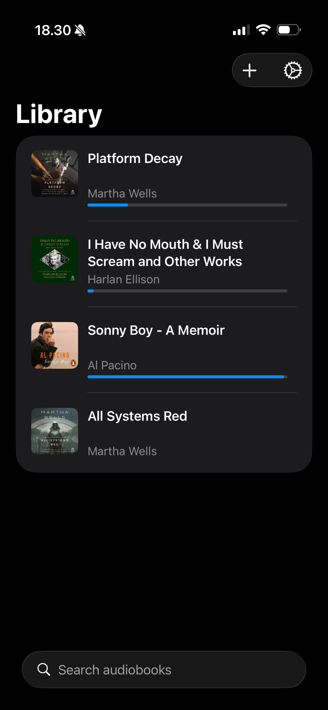
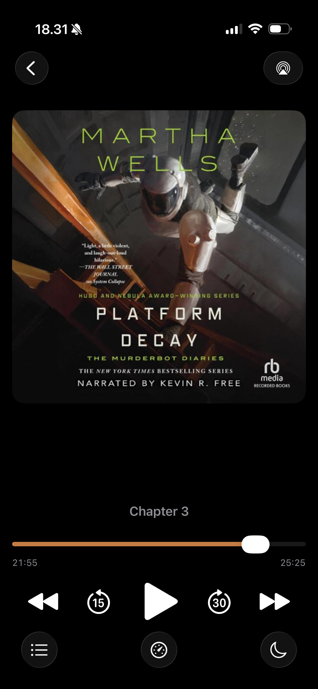
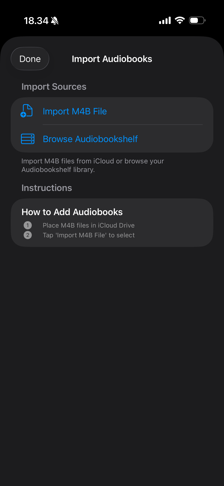

# Listen This

A simple, focused M4B audiobook player for iPhone, iPad, and Apple Watch.

## Features

- **Import** M4B audiobooks from Files or iCloud Drive
- **Chapter navigation** with skip controls
- **Adjustable playback speed** (0.5x - 2.5x)
- **Sleep timer** with shake-to-extend
- **Background playback** with Now Playing controls
- **Home Screen widget** showing current book

## Apple Watch

Listen without your iPhone. Download audiobooks to your Watch for offline playback during workouts, walks, or whenever you leave your phone behind.

## Audiobookshelf

Connect to your self-hosted [Audiobookshelf](https://www.audiobookshelf.org/) server to browse and download your library.

## Sync

Your library and playback position sync automatically across all your devices via iCloud. Start listening on your iPhone, continue on your iPad, finish on your Watch.

## Screenshots

  
  
  

## Requirements

- iOS 18.0+
- watchOS 11.0+
- iCloud account for sync

## Building from Source

1. Clone the repo
2. Open `Listen This.xcodeproj` in Xcode 16+
3. Configure signing with your Apple Developer account
4. Build and run

## License

MIT License - see [LICENSE](LICENSE) for details.
