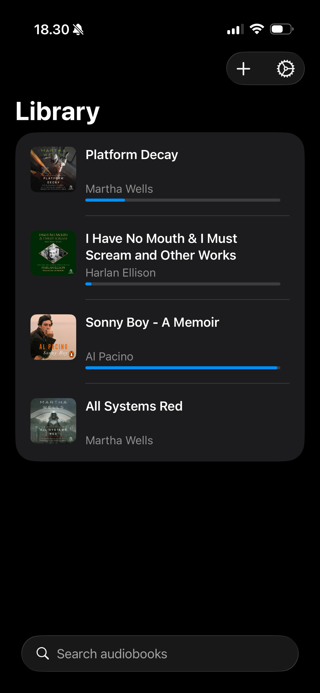
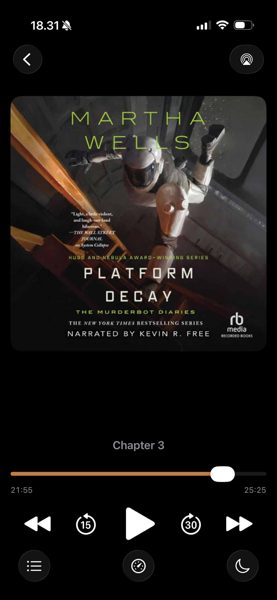
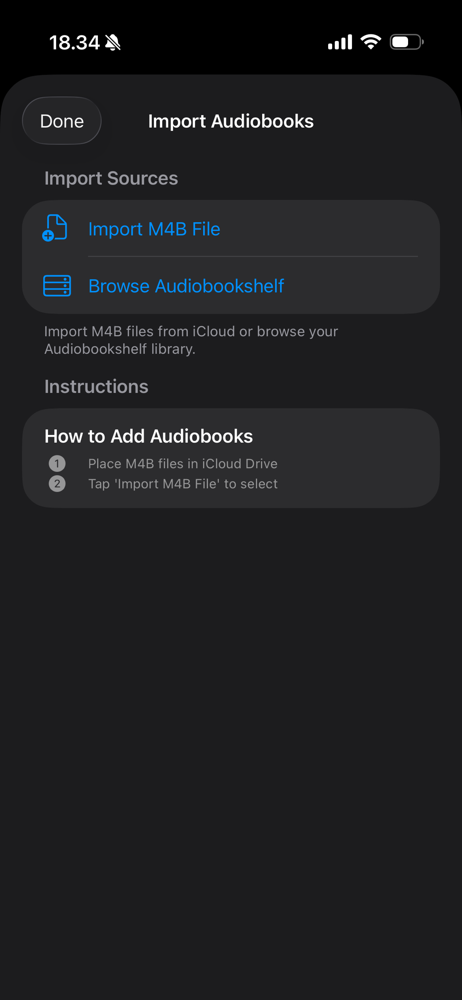

# Listen This

A simple, focused M4B audiobook player for iPhone, iPad, and Apple Watch.

## Features

- **Import** M4B audiobooks from Files or iCloud Drive
- **Chapter navigation** with skip controls
- **Adjustable playback speed** (0.5x - 2.0x)
- **Sleep timer** with presets or end of chapter
- **Background playback** with Now Playing controls
- **Home Screen and Lock Screen widgets**, and **Watch complications**, showing the current book

## Apple Watch

Listen without your iPhone. Download audiobooks to your Watch for offline playback during workouts, walks, or whenever you leave your phone behind.

## Audiobookshelf

Connect to your self-hosted [Audiobookshelf](https://www.audiobookshelf.org/) server to browse and download your library.

The Watch can download from the server directly over WiFi — no iPhone in the loop — as long as it's on a network that can reach the server. Servers on your local network can be plain `http://`; anything reachable from the wider internet needs `https://`.

## Sync

Your library and playback position sync automatically across all your devices via iCloud. Start listening on your iPhone, continue on your iPad, finish on your Watch.

## Screenshots

  
  
  

## Requirements

- iOS 26.2+
- watchOS 26.2+
- iCloud account for sync

## Building from Source

1. Clone the repo
2. Open `Listen This.xcodeproj` in Xcode 26.2+
3. Configure signing with your Apple Developer account
4. Build and run

## License

MIT License - see [LICENSE](LICENSE) for details.
